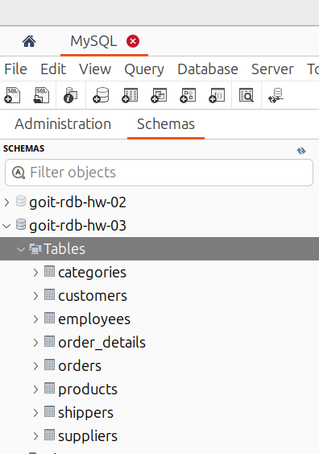
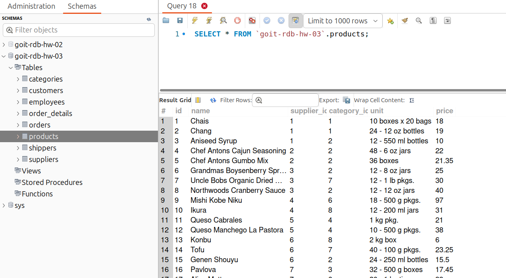
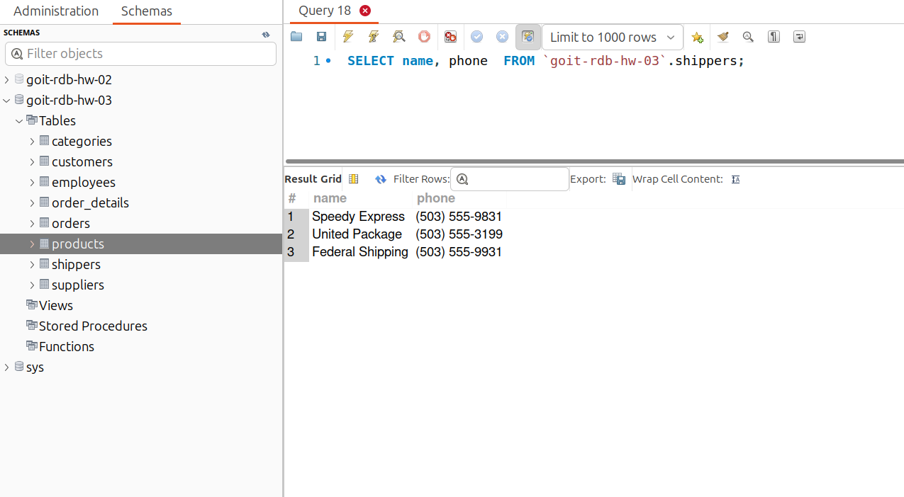
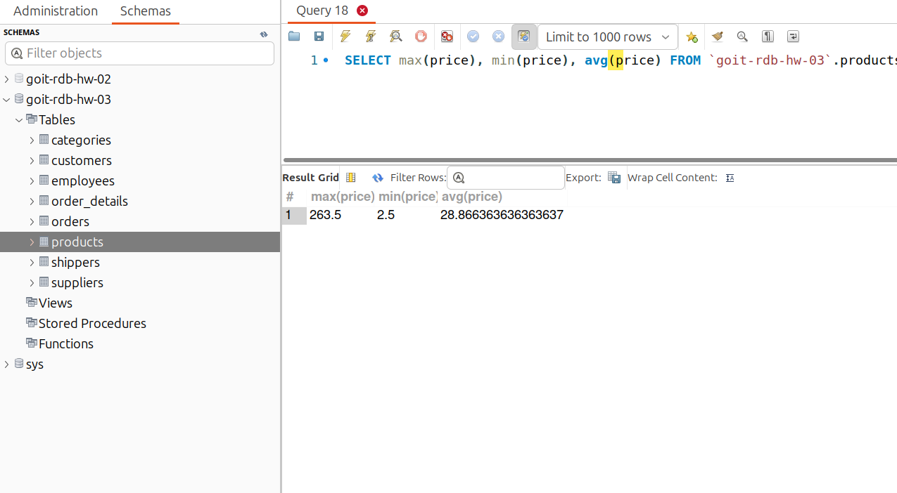
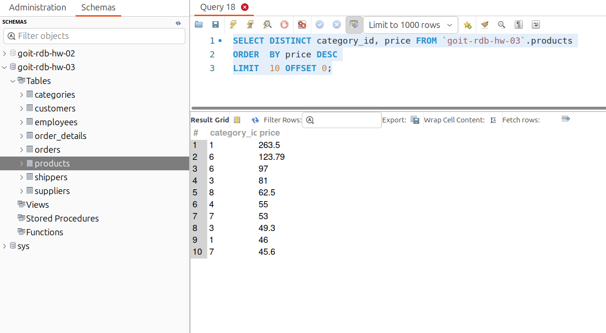
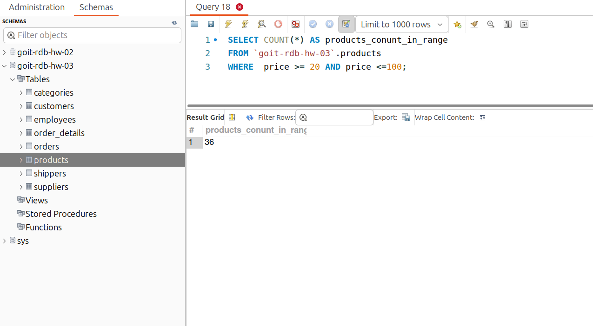
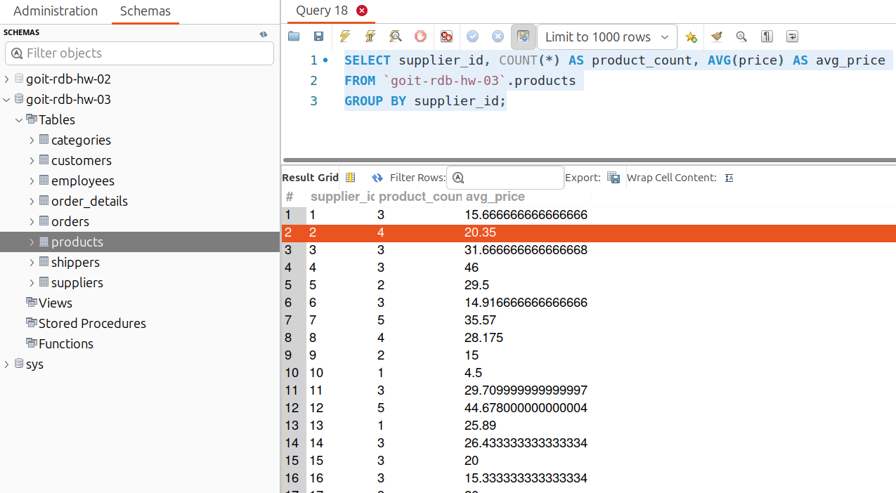

# [Домашнє завдання до Теми 3. Завантаження даних та основи SQL. DQL команди](https://www.edu.goit.global/learn/25315460/21808779/22222321/homework)

## DQL (Data Query Language) — запити до даних.

DQL використовується для “витягування” даних із бази даних. Це включає операції вибірки, які дозволяють отримувати інформацію з таблиць.
Приклади DQL-запитів:

- SELECT: Вибірка даних із таблиць.
- FROM: Вказівка на таблицю або таблиці, з яких вибираються дані.
- WHERE: Умови, за якими вибираються дані.
- GROUP BY: Групує рядки на основі значень одного або кількох стовпців.
- та інші.

## Опис домашнього завдання

1. Імпортувати дані з [csv_dataset.zip](https://drive.google.com/file/d/1B45tkzH3lIrf2CmQIB2VB0AJRB9Ly7c2/view?usp=drive_link)
2. Напишіть SQL команду, за допомогою якої можна:
    - вибрати всі стовпчики (За допомогою wildcard `*`) з таблиці `products`;
    - вибрати тільки стовпчики `name`, `phone` з таблиці `shippers`, та перевірте правильність її виконання в MySQL Workbench.
3. Напишіть SQL команду, за допомогою якої можна знайти середнє, максимальне та мінімальне значення стовпчика `price` таблички `products`, та перевірте правильність її виконання в MySQL Workbench.
4. Напишіть SQL команду, за допомогою якої можна обрати унікальні значення колонок `category_id` та `price` таблиці `products`. Оберіть порядок виведення на екран за спаданням значення `price` та виберіть тільки 10 рядків. Перевірте правильність виконання команди в MySQL Workbench.
5. Напишіть SQL команду, за допомогою якої можна знайти кількість продуктів (рядків), які знаходиться в цінових межах від 20 до 100, та перевірте правильність її виконання в MySQL Workbench.
6. Напишіть SQL команду, за допомогою якої можна знайти кількість продуктів (рядків) та середню ціну (`price`) у кожного постачальника (`supplier_id`), та перевірте правильність її виконання в MySQL Workbench.

### Критерії прийняття

1. Прикріплені посилання на репозиторій goit-rdb-hw-03 та безпосередньо самі файли репозиторію архівом.
2. Написано всі 6 команд. SQL команди виконуються й повертають необхідні дані.

## Рішення
### Створення нової DB
```sql
`ALTER DATABASE`goit-rdb-hw-03`CHARACTER SET = utf8mb4 COLLATE = utf8mb4_unicode_ci;`
```
### Import data


### Вибрати всі стовпчики (За допомогою wildcard `*`) з таблиці `products`
```sql
SELECT * FROM `goit-rdb-hw-03`.products;
```


### Вибрати тільки стовпчики `name`, `phone` з таблиці `shippers`

```sql
SELECT name, phone  FROM `goit-rdb-hw-03`.shippers;
```


### Напишіть SQL команду, за допомогою якої можна знайти середнє, максимальне та мінімальне значення стовпчика `price` таблички `products`, та перевірте правильність її виконання в MySQL Workbench

```sql
SELECT max(price), min(price), avg(price) FROM `goit-rdb-hw-03`.products;
```


### Напишіть SQL команду, за допомогою якої можна обрати унікальні значення колонок `category_id` та `price` таблиці `products`. Оберіть порядок виведення на екран за спаданням значення `price` та виберіть тільки 10 рядків. Перевірте правильність виконання команди в MySQL Workbench.

```sql
SELECT DISTINCT category_id, price FROM `goit-rdb-hw-03`.products
ORDER  BY price DESC
LIMIT  10 OFFSET 0;
```


### Напишіть SQL команду, за допомогою якої можна знайти кількість продуктів (рядків), які знаходиться в цінових межах від 20 до 100, та перевірте правильність її виконання в MySQL Workbench.

```sql
SELECT COUNT(*) AS products_conunt_in_range
FROM `goit-rdb-hw-03`.products
WHERE  price >= 20 AND price <=100;
```

```sql
SELECT COUNT(*) AS products_conunt_in_range
FROM `goit-rdb-hw-03`.products
WHERE  price BETWEEN 20 AND 100;
```



### Напишіть SQL команду, за допомогою якої можна знайти кількість продуктів (рядків) та середню ціну (`price`) у кожного постачальника (`supplier_id`), та перевірте правильність її виконання в MySQL Workbench.

```sql
SELECT supplier_id, COUNT(*) AS product_count, AVG(price) AS avg_price
FROM `goit-rdb-hw-03`.products
GROUP BY supplier_id;
```



### Репозиторій
[goit-rdb-hw-03](https://github.com/nickolas-z/goit-rdb-hw-03)
